<a name="readme-top"></a>

[![Contributors][contributors-shield]][contributors-url]
[![Forks][forks-shield]][forks-url]
[![Stargazers][stars-shield]][stars-url]
[![Issues][issues-shield]][issues-url]
[![MIT License][license-shield]][license-url]

<div align="center">
  <a href="https://github.com/Yukino2002/Bokeverse">
    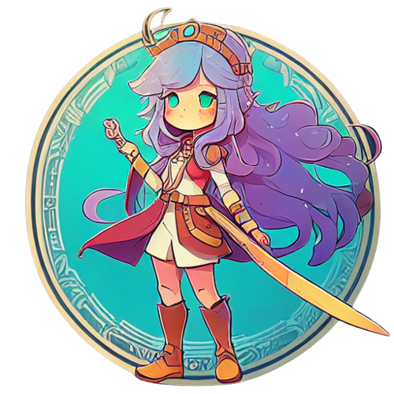
  </a>

<h3 align="center">Bokeverse</h3>

  <p align="center">
    Explore the decentralized world of Bokeverse!
    <br />
    <a href="https://www.youtube.com/watch?v=n_NLohdWMUc">View Demo</a>
    ·
    <a href="https://github.com/Yukino2002/Bokeverse/issues">Report Bug</a>
    ·
    <a href="https://github.com/Yukino2002/Bokeverse/issues">Request Feature</a>
  </p>
</div>

## Table of Contents
<details> 
  <ul>
    <li>
      <a href="#about-the-project">About The Project</a>
      <ul>
        <li><a href="#game-mechanics">Game Mechanics</a></li>
        <li><a href="#technologies-used">Technologies Used</a></li>
      </ul>
    </li>
    <li>
      <a href="#getting-started">Getting Started</a>
      <ul>
        <li><a href="#prerequisites">Prerequisites</a></li>
        <li><a href="#installation">Installation</a></li>
        <li><a href="#running-the-game">Running the game</a></li>
        <li><a href="#deploying-the-smart-contract">Deploying the smart contract</a></li>
        <li><a href="#deploying-the-website">Deploying the website</a></li>
        <li><a href="#minting-bokemonsnfts-to-your-account">Minting Bokemons(NFTs) to your account</a></li>
        <li><a href="#creating-a-qr-code-to-scan">Creating a QR Code to Scan</a></li>
      </ul>
    </li>
    <li>
      <a href="#usage">Usage</a>
      <ul>
        <li><a href="#demo-links">Demo Links</a></li>
        <li><a href="#prerequisites">Prerequisites</a></li>
        <li><a href="#playing-the-game">Playing the Game</a></li>
        <li><a href="#navigating-the-website">Navigating the Website</a></li>
      </ul>
    </li>
    <li><a href="#roadmap">Roadmap</a></li>
    <li><a href="#contributing">Contributing</a></li>
    <li><a href="#license">License</a></li>
    <li><a href="#acknowledgements">Acknowledgements</a></li>
    <li><a href="#contact">Contact</a></li>
  </ul>
</details>

## About The Project

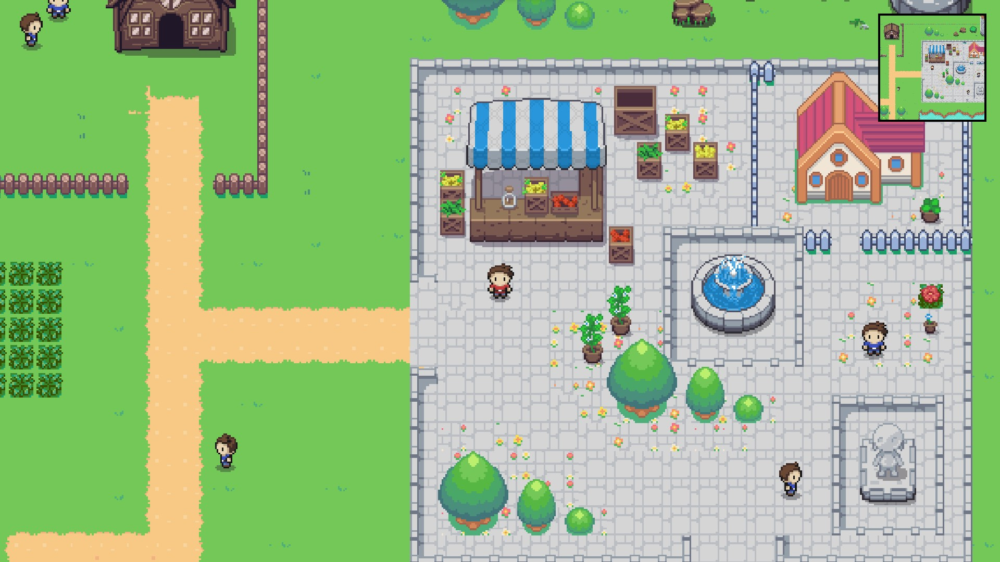

The game is a decentralized 2D open-world RPG with turn-based battles. It is set in a fantasy world, allowing players to explore, fight monsters and possess NFT characters and collectibles registered to their wallet address. We have also included a trading marketplace for NFTs and a QR code generation system to easily access and purchase these NFTs.

[Marketplace Fantom Mainnet Contract](https://ftmscan.com/address/0x059100D2988AAc39Bc14A99F8ad9d39dBdBA22e4)

[Game Fantom Mainnet Contract](https://ftmscan.com/address/0xFF999F6c675d400E7A12BB6E763056C19788da3C)

[Youtube Demo](https://www.youtube.com/watch?v=n_NLohdWMUc)

<p align="right">(<a href="#readme-top">back to top</a>)</p>

## Game Mechanics

The game is made using Unity. As a game engine, Unity is able to provide many of the most important built-in features that make a game work. That means things like physics, animations, 3D/2D rendering, collision detection etc. We can create different game objects and add components to provide them with functionality, and make them interact with each other. These components can be in-built components provided by Unity, or custom scripts that we write ourselves in C#.

## Technologies Used

* [Unity Engine](https://unity.com/)
  * We used version 2021.3.16f1 of the Unity Engine to create the game.
  * Utilized [DoTween](https://assetstore.unity.com/packages/tools/animation/dotween-hotween-v2-27676) animation package for Unity.

* [Thirdweb](https://thirdweb.com/)
  * We used the Thirdweb web3 development framework to integrate web3 into our game and website.

* [Next.js](https://nextjs.org/)
  * We used the powerful Next.js framework to create our website.

<p align="right">(<a href="#readme-top">back to top</a>)</p>

## Getting Started

Before getting a local copy up, you must ensure that you have the necessary software required.

### Prerequisites

* Unity
  ```sh
  https://unity3d.com/get-unity/download
  ```
* Node.js
  ```sh
    https://nodejs.org/en/download/
  ```

### Installation


1. Clone the repo
   ```sh
   git clone https://github.com/Yukino2002/Bokeverse.git
   ```

### Running the game

1. Open the project `Bokemon` in Unity (Editor version is 2021.3.16f1)
2. Open the scene "SampleScene.unity" in `/Bokemon/Assets/Scenes/SampleScene.unity`
3. Open your `Build settings`, select `WebGL` as the target platform.
4. Open `Player settings` > `Resolution and Presentation` and under `WebGLTemplate` choose `Thirdweb`.
5. Save and click `Build and Run` to test out your game in a browser.


### Deploying the smart contract
1. Navigate to the folder `contract`
```sh
cd contract
```
2. Deploy the contract using thirdweb ContractKit
```sh
npx thirdweb deploy .
```
3. Confirm the 2 transactions on unitys dashboard

### Deploying the website
1. Navigate to the folder `website`
```sh
cd website
```
2. Install the required dependencies 
```sh
npm i
```
3. Run the server
```sh
npm run dev
```
### Minting Bokemons(NFTs) to your account
You can get a starting Bokemon(Walruse) from the game. If you want another Bokemon you can use the scripts
1. Navigate to the folder `website`
```sh
cd website
```
2. Navigate to `src\scripts\deployThirdWebNFT.js` and in 
```js
var result = await contract.call("mint", "0xB7E99669e9eDdD2975511FBF059d01969f43D409", uri, 1);
```
replace `0xB7E99669e9eDdD2975511FBF059d01969f43D409` with your own contract address

3. Run `createBokemon` script
```sh
npm run createBokemon
```
### Creating a QR Code to Scan
1. Navigate to the folder `website`
```sh
cd website
```
2. Run `generate` script
```sh
npm run createBokemon
```
3. QR code is generated in the `src\scripts\QRCodeResults` Folder
4. Scan the QR code and obtain a Shiny Girason!!!!


<p align="right">(<a href="#readme-top">back to top</a>)</p>

## Usage

### Demo Links
The links to the working demos(in case of any error, kindly reload, the game will run smoothly) and articles of the project are as follows:

* [Website](https://bokeverse.netlify.app/)
* [Game](https://gateway.ipfscdn.io/ipfs/QmXoX5jmrt5kDTR8VQvCWY9viCe9k84JahsCodqhFiXBai/)
* [Video](https://www.youtube.com/watch?v=n_NLohdWMUc)
* [Marketplace Fantom Mainnet Contract](https://ftmscan.com/address/0x059100D2988AAc39Bc14A99F8ad9d39dBdBA22e4)
* [Game Fantom Mainnet Contract](https://ftmscan.com/address/0xFF999F6c675d400E7A12BB6E763056C19788da3C)

### Prerequisites

* [MetaMask](https://metamask.io/), [Coinbase](https://wallet.coinbase.com/) or any other wallet that supports the Ethereum network.
* Some mainnet FTM to pay for gas fees.

### Playing the Game

* On start, the user sees the start menu, where they must connect a wallet to play. The wallet options are MetaMask, Coinbase Wallet, etc.

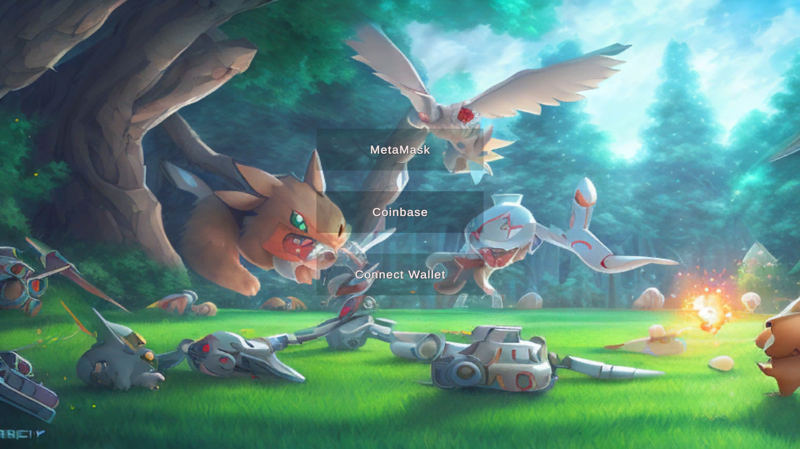

* With a connected wallet, players can explore, battle Bokemons, etc. They must first have a Bokemon linked to their wallet. Otherwise, they can't access the wild grass where Bokemons appear. A message appears, telling the player to talk to the white-haired NPC for a starter Bokemon.

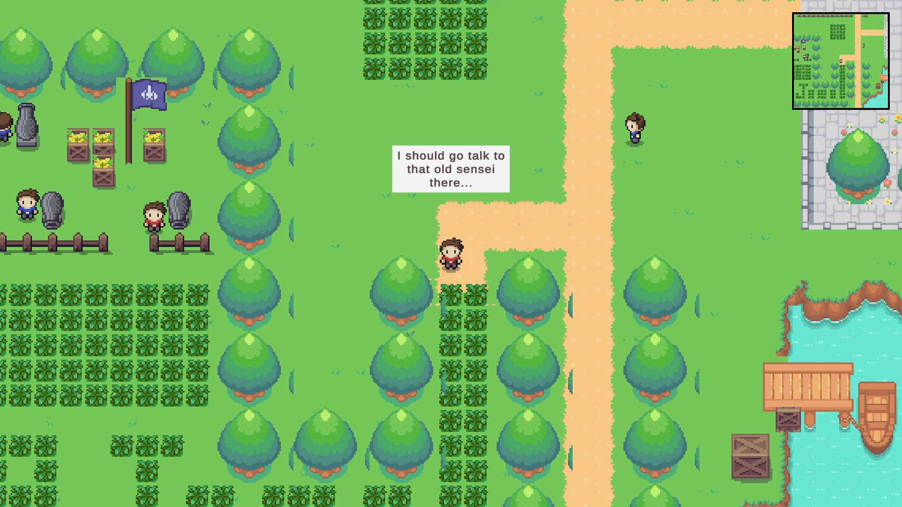

* The player visits the white-haired NPC. If they lack a Bokemon and their party size is 0, they'll sign a transaction for a Bokemon NFT. The NFT is made using the player's wallet as seed and sent to the wallet. Wait briefly for transaction completion. If transaction fails or rejected, try again.

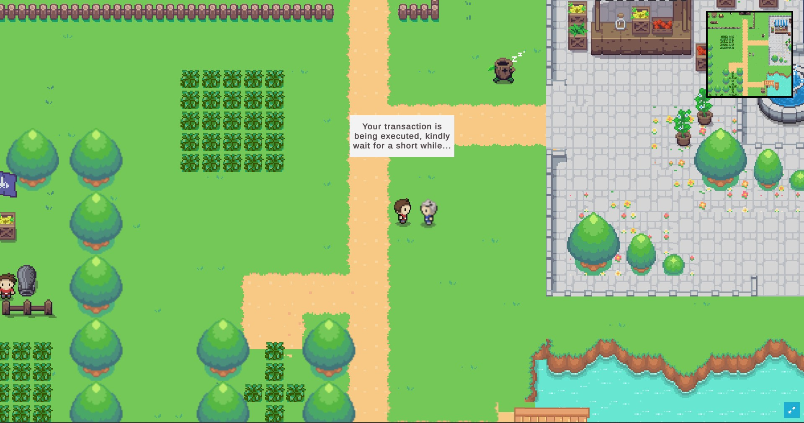

* Receive Walruse, the popular Ice-type Bokemon! Explore the wild grass and battle other Bokemons. On the battle screen, you can attack, flee, or switch Bokemons. Use the right attack for the right Bokemon as some are more effective against certain types. Use 'Z' to choose and 'X' to return.

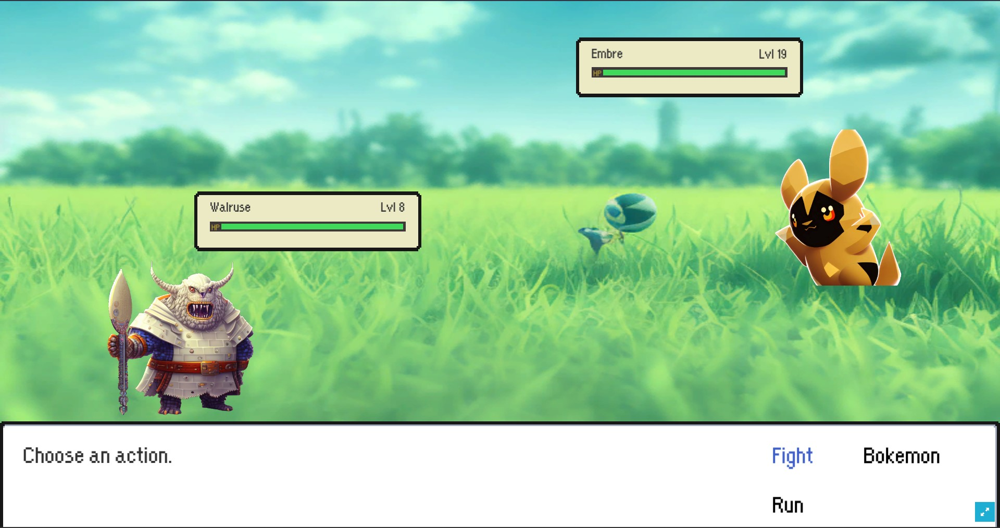

* After winning, experience points are earned and a write operation updates the Bokemon data. If the transaction is rejected, the Bokemon won't level up. If accepted, you'll see a message to wait for the transaction to complete.

* If all party Bokemons are defeated, the battle ends and you'll be asked to heal them. Go to the sleeping healing tree to heal your Bokemons.

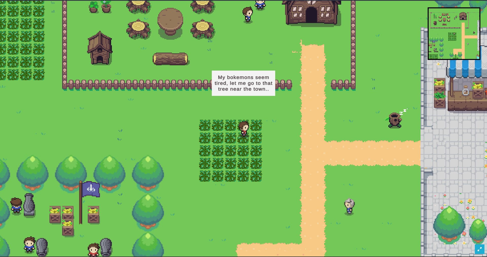

### Navigating the Website

* You can purchase bokemons from the marketplace and increase your party size, and find rare bokemons!

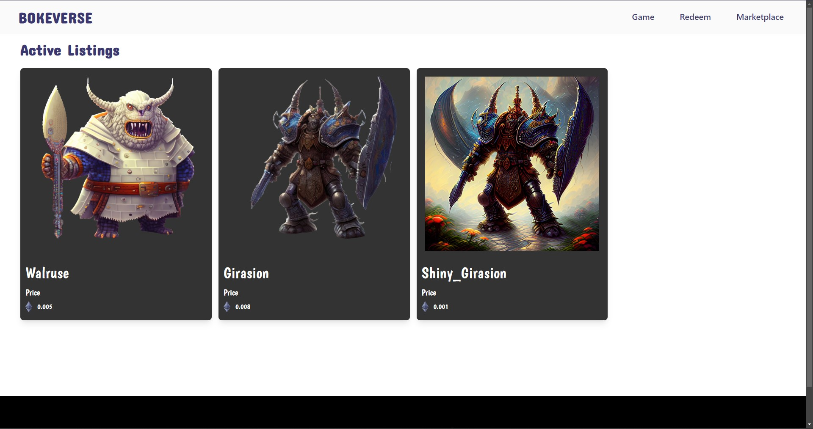

* You can also redeem bokemons from QR codes.

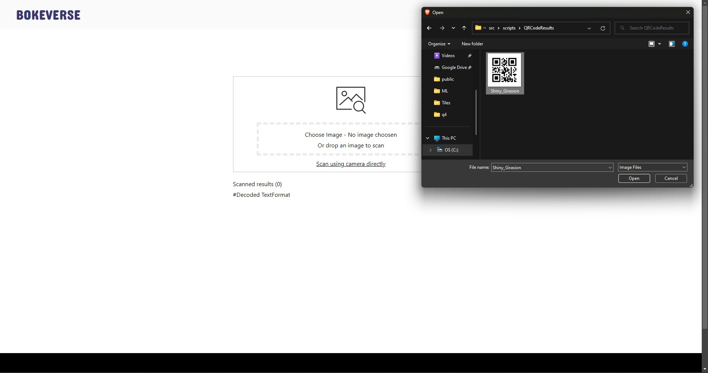

You're all set to go! You can now battle other Bokemons, explore the map, and have fun! If you want more Bokemons, you can visit the Bokeverse marketplace and buy a Bokemon NFT or redeeem through external QR codes.

<p align="right">(<a href="#readme-top">back to top</a>)</p>

## Roadmap

- [ ] Improving the graphics and overall visual appearance of the game

- [ ] Adding more NFT bokemons and collectibles for players to possess

- [ ] Adding more quest lines, battles, and exploration elements to the game

- [ ] Introducing new gameplay elements such as PvP arenas, boss battles, and more.

- [ ] Add physical trading cards for redeeming in-game bokemons from the website. Sample design below:

  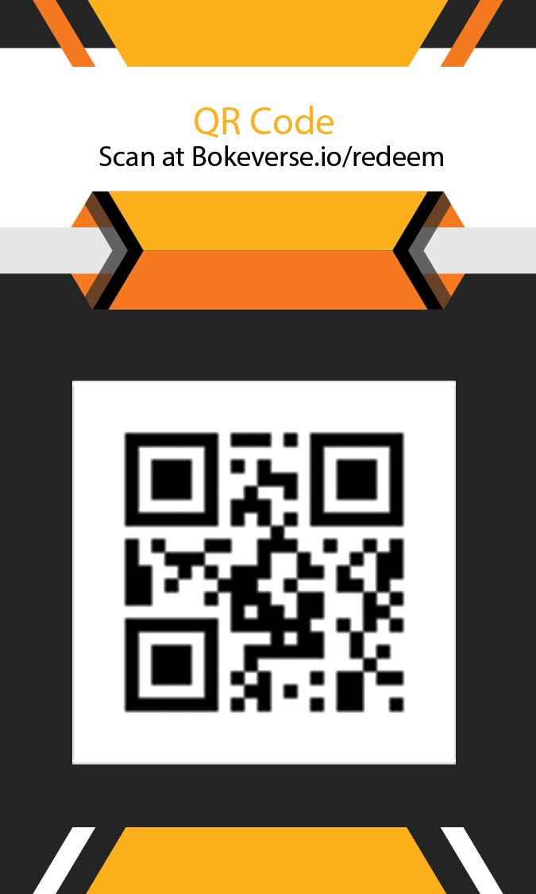
  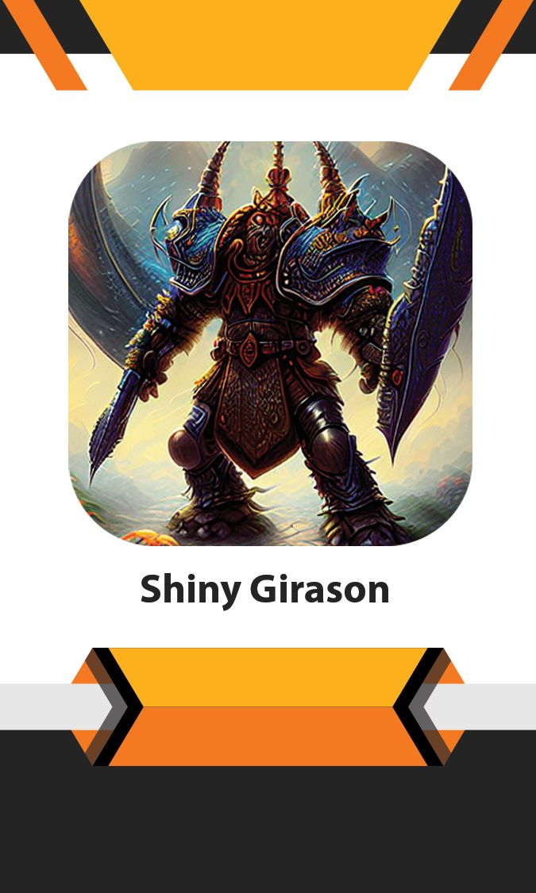

<p align="right">(<a href="#readme-top">back to top</a>)</p>

## Contributing

Contributions are what make the open source community such an amazing place to learn, inspire, and create. Any contributions you make are **greatly appreciated**.

If you have a suggestion that would make this better, please fork the repo and create a pull request. You can also simply open an issue with the tag "enhancement".
Don't forget to give the project a star! Thanks again!

1. Fork the Project
2. Create your Feature Branch (`git checkout -b feature/AmazingFeature`)
3. Commit your Changes (`git commit -m 'Add some AmazingFeature'`)
4. Push to the Branch (`git push origin feature/AmazingFeature`)
5. Open a Pull Request

<p align="right">(<a href="#readme-top">back to top</a>)</p>

## License

Distributed under the MIT License. See `LICENSE.txt` for more information.

<p align="right">(<a href="#readme-top">back to top</a>)</p>

## Acknowledgements

 - [Best-README-Template](https://github.com/othneildrew/Best-README-Template)
 - [Marketplace-Frontend](https://blog.thirdweb.com/guides/how-to-create-an-nft-marketplace-with-nextjs-and-thirdweb-on-polygon-network/)
 - [Sound Tracks](https://pixabay.com/music/search/game%20background/?manual_search=1&order=None)
  - [Tileset](https://cypor.itch.io/12x12-rpg-tileset)

<p align="right">(<a href="#readme-top">back to top</a>)</p>

## Contact

Pratik Jallan - [LinkedIn](https://www.linkedin.com/in/pratik-jallan/) - pratikjalan11@gmail.com

Asim Jawahir - [LinkedIn](https://www.linkedin.com/in/asimjawahir/) - asimjawahir123@gmail.com

<p align="right">(<a href="#readme-top">back to top</a>)</p>

[contributors-shield]: https://img.shields.io/github/contributors/Yukino2002/Bokeverse.svg?style=for-the-badge
[contributors-url]: https://github.com/Yukino2002/Bokeverse/graphs/contributors
[forks-shield]: https://img.shields.io/github/forks/Yukino2002/Bokeverse.svg?style=for-the-badge
[forks-url]: https://github.com/Yukino2002/Bokeverse/network/members
[stars-shield]: https://img.shields.io/github/stars/Yukino2002/Bokeverse.svg?style=for-the-badge
[stars-url]: https://github.com/Yukino2002/Bokeverse/stargazers
[issues-shield]: https://img.shields.io/github/issues/Yukino2002/Bokeverse.svg?style=for-the-badge
[issues-url]: https://github.com/Yukino2002/Bokeverse/issues
[license-shield]: https://img.shields.io/github/license/Yukino2002/Bokeverse.svg?style=for-the-badge
[license-url]: https://github.com/Yukino2002/Bokeverse/blob/main/LICENSE.txt
